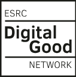

> This project promotes digital equity by empowering members from under-represented communities to co-produce data visualisations and tools that examine and challenge the impact of neutrality as a guiding principle in a particular and relevant case of digital good: OpenStreetMap \[OSM\].

## Latest blog posts

::: {#latest-posts}
:::

## Funding

This project is funded by the [ESRC Digital Good Network](https://digitalgood.net/) through their Digital Good Research Fund 2024-25. 