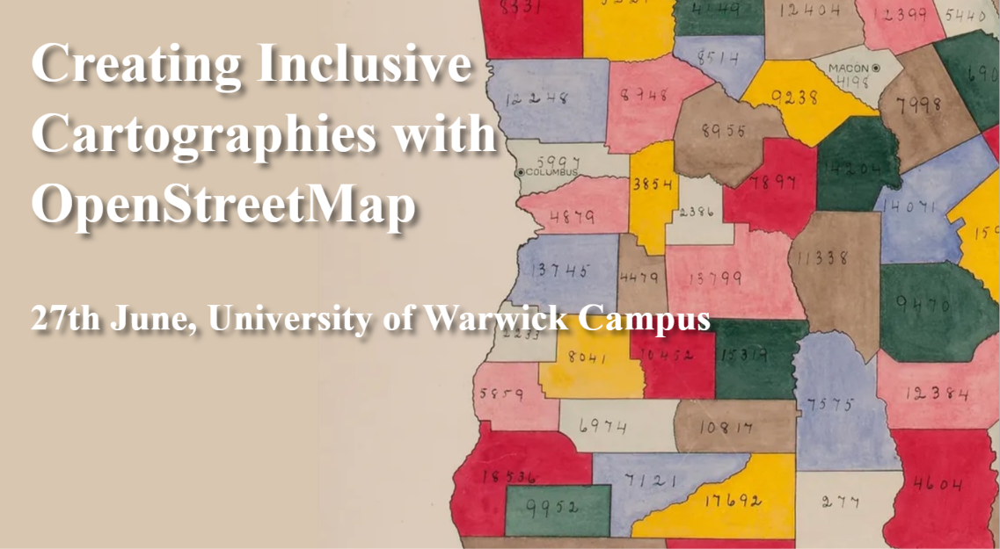
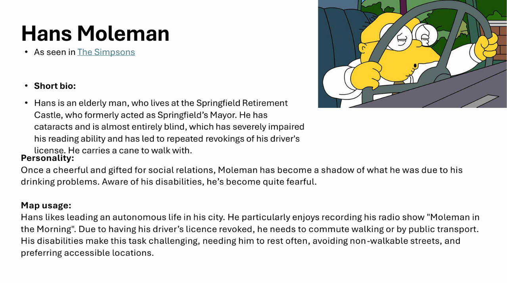
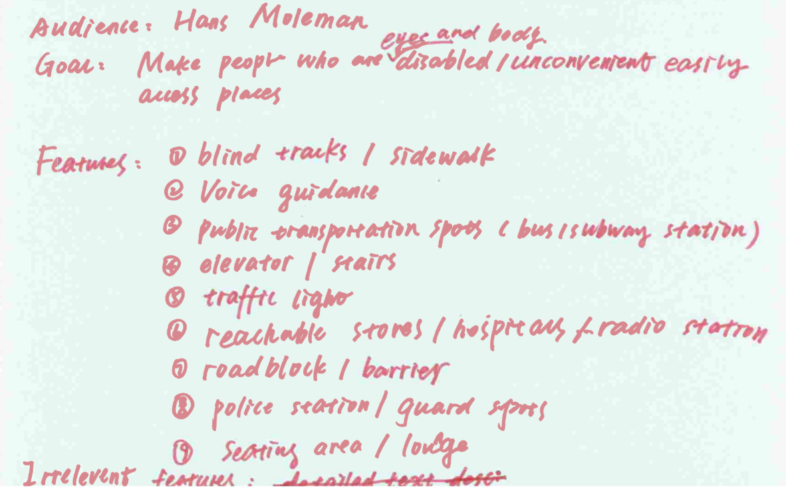
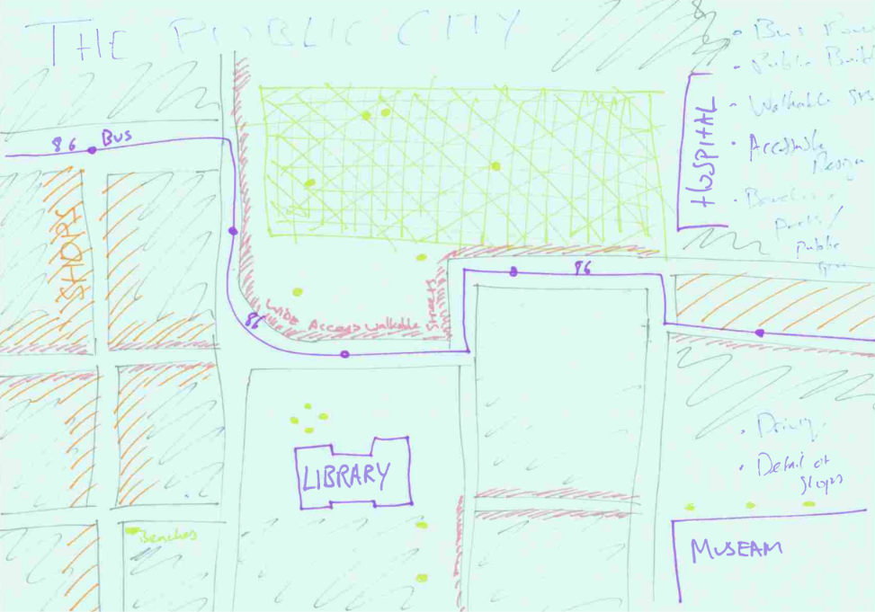
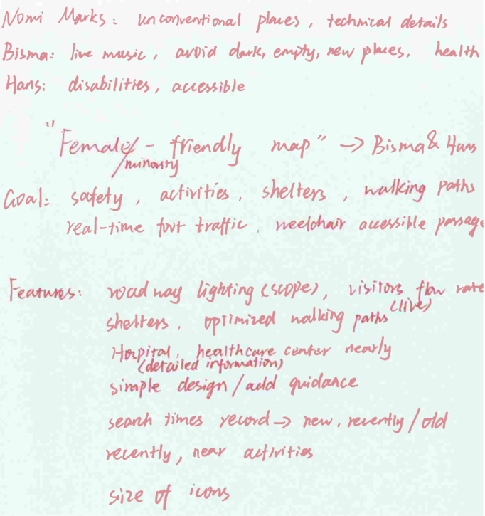

The first workshop of the Inclusive Cartographies Series was held at the University of Warwick on Friday 27 June, from 09:00-17:00.

## Introductions

The day started with introductions to the project and everyone involved: Carlos Cámara and Timothy Monteath from the University of Warwick; Selene Yang, Alejandra Canclini and Silvia Ribera-Alfaro from Geochicas, and of course the participants themselves, who kindly shared about what brought them to the workshop and their initial awareness of maps and their impacts for under-represented communities.

Although anyone is welcome at this series of workshops, we particularly thought it would interest people from non-hegemonic demographics (women, racialized, LGTBQ+) who feel that current maps do not sufficiently address their needs; map and data visualisation enthusiasts, especially OpenStreetMap users; activists and researchers; and particularly, anyone with a keen interest in EDI issues and inequalities (we particularly welcome people interested in issues related to gender, race or queer topics).

## Talks

The session started with a presentation on **maps, gender and feminist mapping**. Participants explored the features that stand out on popular existing maps (such as Google Maps, Bing Maps, Apple Maps or OpenStreetMap) and considered what kind of information was missing. There was some discussion of the ways men/boys use and perceive spaces differently to women/girls, and how failing to account for this means "public spaces become male spaces by default" (Caroline Criado Pérez in *Invisible Women,* 2019).[^1]

[^1]: For more information, check out [Caroline Criado Pérez's blog post](https://carolinecriadoperez.com/article/iw-228-default-male-gaze/) about this.

Next, Carlos Cámara gave us an **introduction to OSM**:

```{=html}
<embed src="OSM-slides.pdf" width="100%" height="500px" />

```

Following these initial talks, there was a discussion about **cartography and inclusivity**, using a set of ‘personas’ as a starting point. For instance, for the persona of Hans Moleman...



...the following template was produced.



The personas provided were then used as a jumping-off point for participants 'to adapt, copy, or ignore'. Each of them created a persona including name, personality, and cases in which the individual would want to use a map.

## Topics and Group Creation

After a coffee break, participants were asked to think about what current maps might be missing, particularly with regard to facilitating activities that groups such as women, elderly people, children, LGBT+ people and racialised minorities need to do. Each participant stuck on the wall a project template with a proposed:

- Map title

- Problem for the map to address

- Audience

- Drawing

- Scale (e.g., city, region)



The participants then formed groups by affinity, gathering by topics they wanted to work on and merging similar ideas. At least one spokesperson per group was nominated, along with one notetaker to document the map's title, aim, audience, features to be represented, principles, further improvements and conclusions.



## Data

Each group listed the data they wanted to visualise in their map and considered how they would want it to be represented. Then, they queried OSM data to see which features were and were not available. They also took notes on what was missing, what could be improved, and what could be used as a proxy from existing data.

## Cartography

Following an hour's lunch break, Tim Monteath gave a talk on how to use Maputnik, a tool for creating cartographies:


```{=html}
<embed src="Workshop-Maputnik.pdf" width="100%" height="500px" />

```

Participants then used Maputnik to create cartographies and share their progress.

## Evaluation

Finally, participants filled in a survey about the workshop. There was also a roundtable to discuss reflections and lessons learnt.

It was found over the course of this workshop that there is a steep learning curve when it comes to cartographic tools. Further, Maputnik itself was found to be somewhat limited for our ends.

As a result, we decided to split the next workshops between two dedicated to creating design briefs, and one focused on cartography. We also turned from Maputnik to QGIS as a replacement.