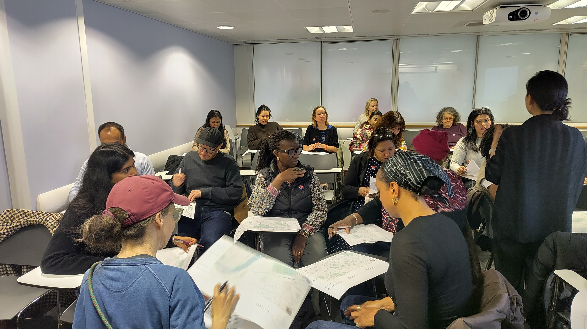
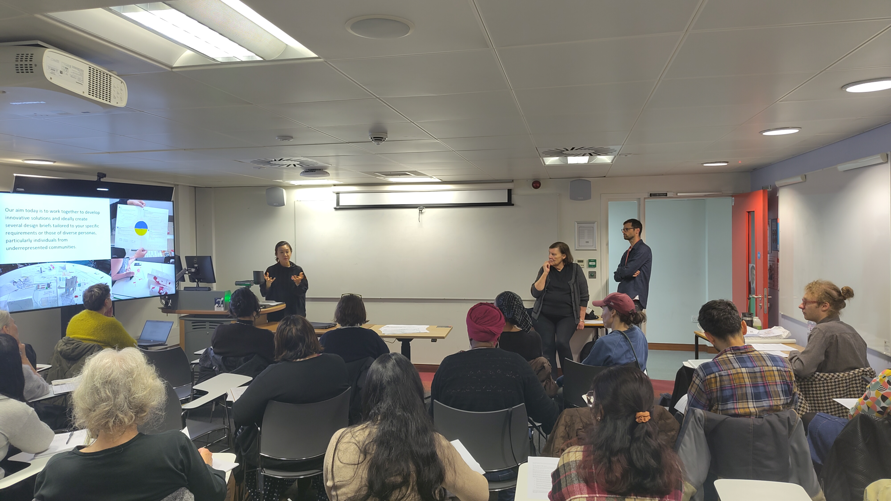
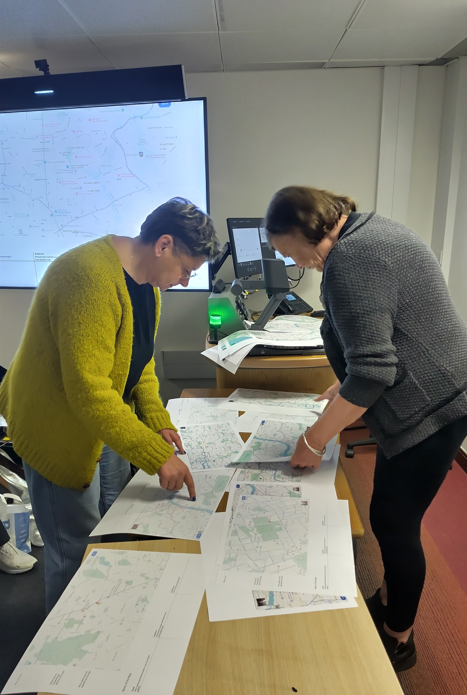

Two workshops in the Inclusive Cartography Series were run in October with a focus on creating design briefs. The first, co-organised with the [LivingMaps network](https://www.livingmaps.org/), was held at King's College London on Saturday 18 October 2025, from 10:00-14:00. The second was run online via Microsoft Teams on Friday 24 October, from 10:00-12:00. See the bottom of this page for both sets of slides.

## LivingMaps Network



Thanks to Jina Lee, Mike Duggan and Barbara Brayshay from LivingMaps for discussing the aim and process of designing innovative, inclusive maps in our in-person workshop on 18 October. The slides from their talk are below:


```{=html}
<embed src="LivingMaps-Slides.pdf" width="100%" height="500px" />

```

## From Maps to Briefs

Participants started by 'reverse-engineering' design briefs, looking at popular existing maps such as Google Maps or Apple Maps and noticing those maps' features and what activities and populations they seemed designed (or *didn't* seem designed) to serve.



## Creating Design Briefs

Next, the participants worked in groups to produce their own briefs. This included considering who the map would be for, and how that audience would use it. Further, it involved discussing design considerations such as the use of icons and colours, and outlining which features were worth and not worth including, based on the purpose. Groups also produced sketches to guide in the eventual cartography process.

Two examples of briefs produced are below:

<object class="pdf" data="free-city-brief.pdf" width="100%" height="500">

</object>

<object class="pdf" data="safety-brief" width="100%" height="500">

</object>

## Evaluations

At the end of the workshops, participants were asked to submit a survey on their reflections and experiences.

## Slides

Workshop 18/10/25:

<object class="pdf" data="2025-10-18-cim-slides.pdf" width="100%" height="500">

</object>

Workshop 24/10/25:

<object class="pdf" data="2025-10-24-slides.pdf" width="100%" height="500">

</object>