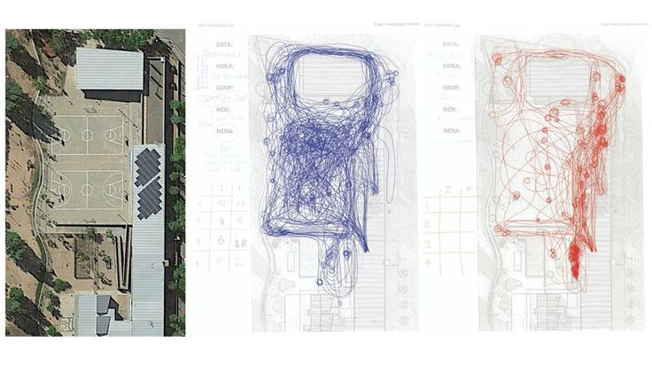
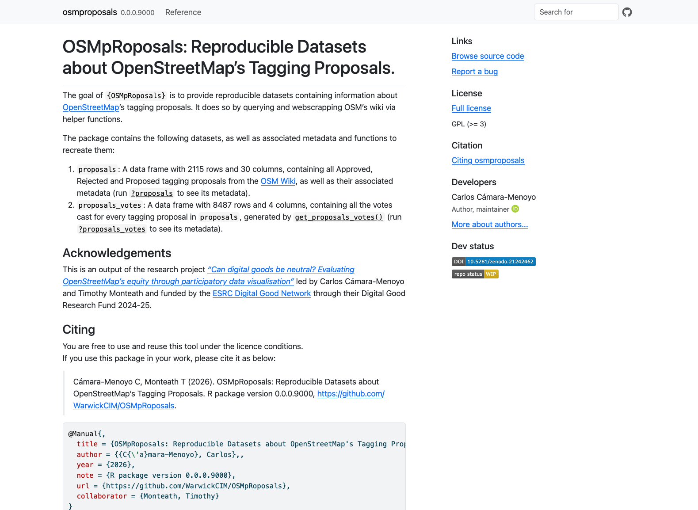
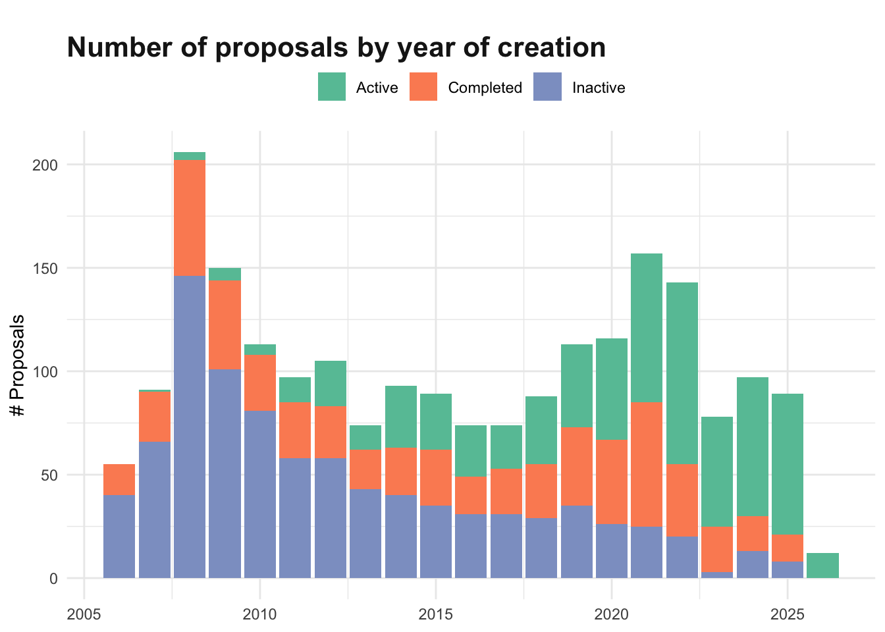
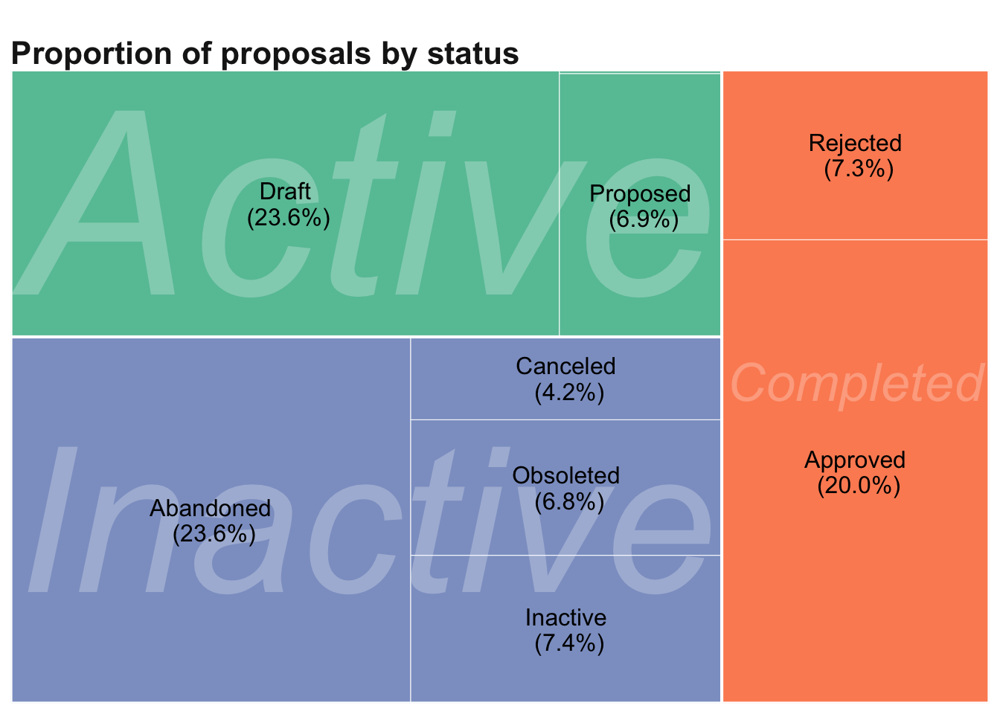
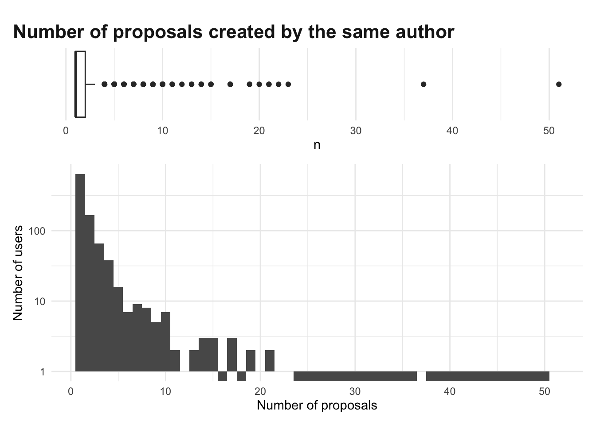
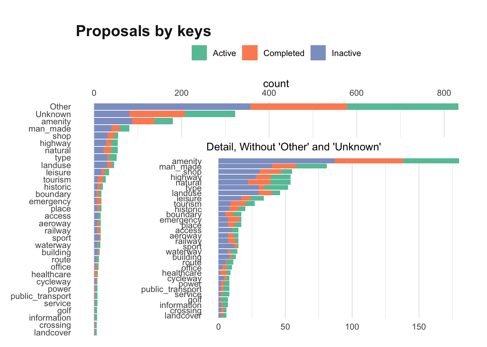
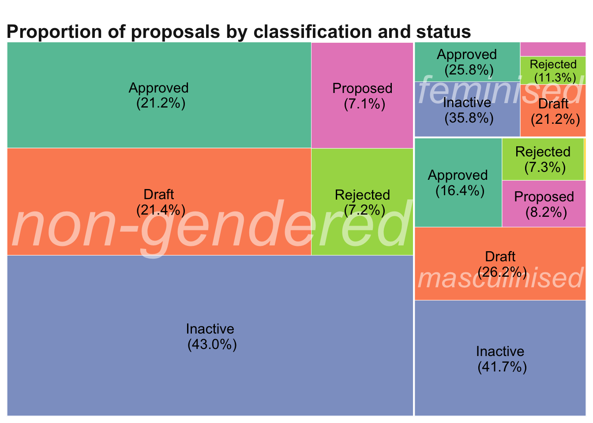
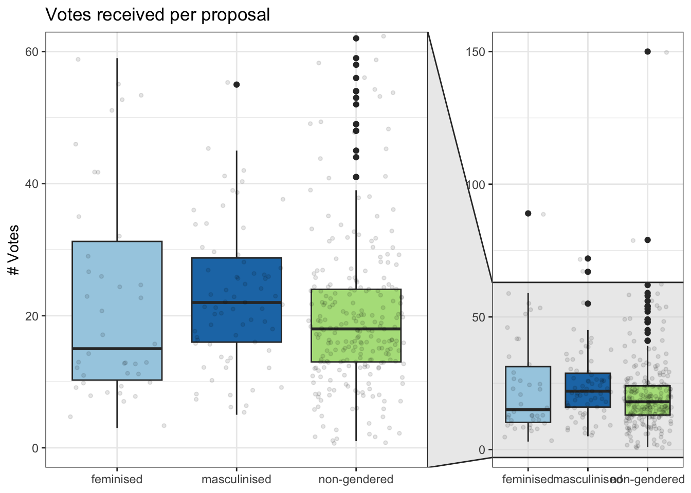
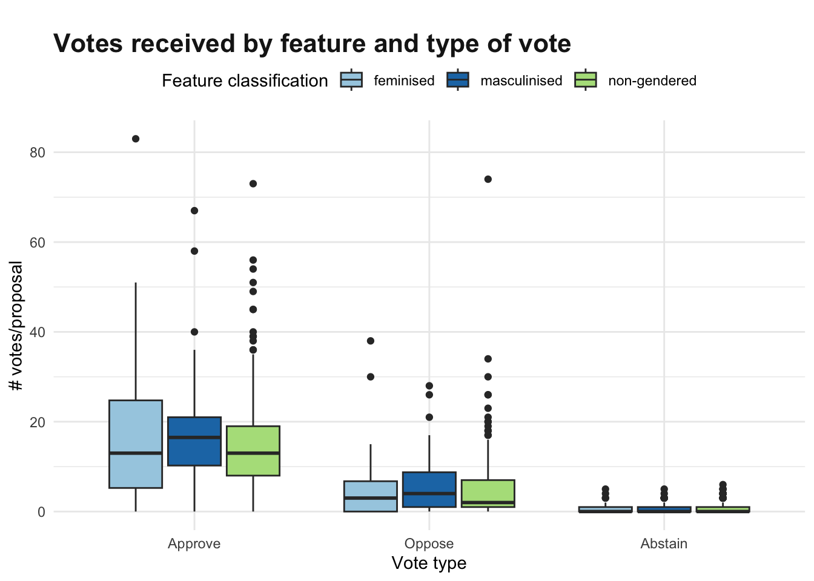
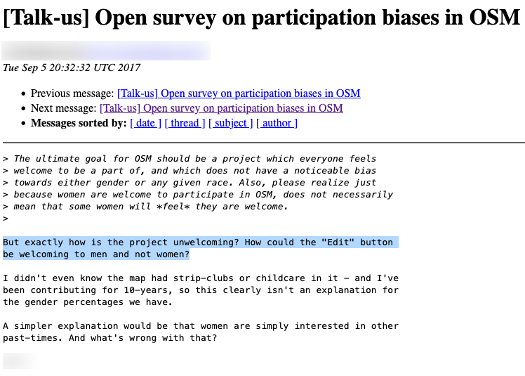

```{r setup}

# remotes::install_github("WarwickCIM/osmproposals")
library(osmproposals)
data("proposals")
data("proposals_votes")
```

## About me {.center background-image="https://v5.carloscamara.es/talk/2019-06-13-urban-accessibility-workshop/featured_hu27f7dc34c9db8fd2b063f3fba6be9864_461093_1200x0_resize_q90_lanczos.jpg" background-opacity="0.3" background-color="black"}

Dr. **Carlos Cámara-Menoyo\
Principal Research Software Engineer,**\
Centre for Interdisciplinary Methodologies, University of Warwick (UK)\
[carlos.camara\@warwick.ac.uk](#) \| Fedi: [\@ccamara\@scholar.social](https://scholar.social/@ccamara)

**At OSM:**\
I'm `ccamara`, OSM contributor since 2011\
From very active to almost inactive. Mostly tagging accessibility, buildings\
Led mapping parties and Humanitarian OSM with [Collaborative Mapping](https://mapcolabora.org) and some import initiatives with OSM's [Spanish](https://openstreetmap.es/) and [Catalan](https://www.osmcatala.cat/) local chapters.

::: notes
Positionality, too:

I happen to be a white, heterosexual, cis male who works for a university in the global north.
:::

# Overview

1.  Present an R-package (still under development) and showcase the methodological possibilities for research that it enables
2.  Present some preliminary results in relation to EDI/DEI in OSM
3.  Foster discussions towards making OSM more inclusive and equitable.

# Our research {.smaller background-color="#BBDF46" background-image="../../media/esrc_digital_good_network.png" background-position="95% 5%" background-size="127px 128px"}

::: r-fit-text
Can Digital Goods Be Neutral?
:::

::: r-fit-text
Evaluating OpenStreetMap’s equity through participatory data visualisation
:::

The foundations of this work reside on the collaborative work made with an **amazing team**:

:::::: columns
::: {.column width="30%"}
UNIVERSITY OF WARWICK

- Dr. Carlos Cámara-Menoyo (PI)

- Dr. Timothy Monteath (Co-I)

- Hazel Cyril, Lilly Makkos (RAs)
:::

::: {.column width="30%"}
GEOCHICAS

- Dr. Selene Yang

- Silvia Rivera Alfaro

- Alejandra Canclini
:::

::: {.column width="30%"}
ADVISORY GROUP

- Dr. Jorge León (Universidad de Zaragoza)

- Dr. Rachel Palmen (Universitat Oberta de Catalunya)
:::
::::::

This project was **funded by the ESRC Digital Good Network**, through their Research Fund 2024-25.

# Introduction {background-image="media/960px-Nova_totius_Terrarum_Orbis_geographica_ac_hydrographica_tabula_(Hendrik_Hondius)_balanced.jpg" background-opacity="0.6"}

## The problem

- There’s a long history of maps and power [@crampton2009; @harley2008; @wood1992]

  - Maps are never neutral: they have a political agenda [@haraway1988; @harley1989; @monmonier2018]
  - Historically used for domination, control and/or surveillance [@foucault1995; @scott2020; @graham2005; @edney1999]

- Critical and Feminist Geography have **critiqued map’s objectivity**:

  - Flagging (unconscious) bias by map-makers (usually men) [@monk1982]

  - Challenging positivist approaches and based exclusively in quantification [@pickles1995]

  - Importance on what is being presented and silenced [@pavlovskaya2009; @kwan2002; @dignazio2020]

  - More than representations: cultural expressions [@turnbull1989]

## The opportunity

The emergence of **neogeography** [@turner2006], **Volunteered Geographic Information** [@goodchild2007], and particularly, **OSM** as an opportunity to address those issues [@haklay2008]:

- No longer for/by elite: [Anyone can create their own maps]{.highlight-text}

  - OSM goes further: anyone can add anything on the map, and decide how to describe it[^1]

- Opportunity to [include a myriad of different worldviews]{.highlight-text}

  - Resulting maps could be more equitable and counter-power and resistance tools [@krupar2015]

[^1]: At least, technically

##  {background-image="https://images.gutefrage.net/media/fragen/bilder/moechten-sie-im-teletubbieland-entspannen/0_big.jpg" background-opacity="0.4" background-color="black" data-menu="Yes, but..."}

::: r-fit-text
Yes, but...
:::

## Still a lot to do {background-image="https://media.licdn.com/dms/image/v2/D4D12AQGwDx7KAQnqAA/article-cover_image-shrink_720_1280/article-cover_image-shrink_720_1280/0/1662951830856?e=2147483647&v=beta&t=5mFAMCKfDzQxHgVDPj4cQ91GjkD4j8xOd7DKYpsL0pM" background-opacity="0.4" background-color="black"}

The **lack of diversity in the community is still a concern**, as flagged by:

- Community members:
  - Gender survey [@geochicas2020]: Men 58%, Women, 39%; Other: 19%
  - OSMF's Diversity and Inclusion Special Committee (on hold)
  - Recurrent messages at discourse and mailing list
- Scholarly publications:
  - [@gardner2020]
  - [@stephens2013]
  - [@das2019]

# Our talk (and upcoming paper) {.smaller}

Dialogues with prior scholarly on gendered uses of space and contributions to OSM.

::::: columns
::: {.column width="50%"}
**Aims:**

1.  Assess if this issue is still present in 2026 and in other types of contributions.

2.  Implement a reproducible, computational workflow that allows for replication in the future.

3.  Foster discussions towards making OSM more inclusive and equitable.

We do so by studying **every tagging proposal being documented since** `r lubridate::year(min(proposals$date_of_page_creation, na.rm = TRUE))`.
:::

::: {.column width="50%"}

:::
:::::

## The Gap

Previous research on OSM Contributions focuses on **map contributions (i.e. changesets) only**, a particular type of contributing.

We will be [embracing pluralism by **focusing on tagging proposals**]{.highlight-text}:

1.  Different type of contribution
    1.  may yield different results (e.g. may be favoured by different type of contributors)
    2.  Halfway between map contributions and project's governance: defines OSM's ontology
2.  Reinforces the idea that [all forms of contributing to OSM are equally important]{.highlight-text} (in line with data feminism principles [@dignazio2020])

# Methods {background-color="#BBDF46"}

## Data {.smaller}

:::::: columns
::: {.column width="50%"}
#### **Via** {OSMpRoposals} R-package: **Provides two reproducible, citable, documented and ready to use (offline)** datasets/dataframes**:**

1.  `proposals`: a dataframe of every tagging proposal, consisting of `r format(nrow(proposals), big.mark=",")` rows and `r ncol(proposals)` columns.
2.  `votes`: a dataframe of every vote cast, consisting of `r format(nrow(proposals_votes), big.mark=",")`\` rows and `r ncol(proposals_votes)` columns.

**Methods: Data Gathering and cleaning:**

1.  Data Gathering: API Query (MediaWiki) +

    Web scrapping

2.  Data cleaning: filtering right types of content, values extraction, formatting...

**Documentation**

1.  Datasets' metadata
2.  Functions
3.  Usage and download (WIP)
4.  DOI and how to cite
:::

:::: {.column width="50%"}


::: {.callout-warning appearance="simple"}
The package [@cámara-menoyo2026] is in early stages of development. **Contributions are welcome!** (especially to improve efficiency/speed and testing)

Todo:

1.  Testing
2.  Incorporate download link to datasets (no need to install anything)
:::
::::
::::::

## Features' classification {.smaller .center}

Features were automatically classified as perceived as "feminised," "masculinised," or "not gendered" (i.e., belonging to neither category) based on the presence of keywords in their titles and descriptions:

+----------------------+----------------------------------------------------------------+
| Feminised features   | Masculinised features                                          |
+======================+================================================================+
| - Care               | - Driving, Motor and private means of transport (car, bike...) |
|                      |                                                                |
| - Children           | - Sports                                                       |
|                      |                                                                |
| - Women and feminine | - Defense and military                                         |
|                      |                                                                |
| - Primary education  | - Sex and nightlife                                            |
|                      |                                                                |
| - Public transport   |                                                                |
+----------------------+----------------------------------------------------------------+

::: {.callout-warning appearance="simple"}
- This classification refers to how these features are usually **perceived,** without implying any judgement.

- A way to overcome the limitation of not having a census or other official ways to quantify demographics/diversity

- Based on prior scholarship examining the gendered dimensions of spaces and infrastructures [@das2019; @kern2020; @leszczynski2015; @stephens2013], and gender performativity theory [@butler2011].

- Authors are aware of theoretical limitations due to a binary approach + risks of reinforcing role genders that we do not endorse.

- Happy to discuss this.
:::

::: notes
drawing on prior scholarship examining the gendered dimensions of digital spaces and infrastructures \[13,20,21\], and gender performativity theory \[22,22\], we developed an automated classification procedure to categorise each tagging proposal as perceived as “feminised”, “masculinised”, or “not gendered” (i.e., belonging to neither category), based on the presence of specific keywords in the proposals’ title or associated tagging scheme.
:::

# Results {background-image="https://clipart-library.com/images/6cy5qeGzi.jpg" background-opacity="0.8" background-color="black"}

Note that they are preliminary results!

## About the process {.smaller}

::::: columns
::: {.column width="50%"}

:::

::: {.column width="50%"}

:::
:::::

1.  There are still a significant of tagging proposals being made (and approved): **the map is far from being complete** (in scope, too).
2.  **Only 20% of proposals ever get approved.** This is not because fof high rejection rates (only 7.3%), but because **few are ever completed (27%):**
    1.  Due to high abandonment rates (42% are inactive) + time-consuming process (30% are still being developed).

## About the users involved {.center .smaller}

::::: columns
::: {.column width="50%"}
- **Only 982 different users** have ever created a tagging proposal **(only 0.009% of total OSM users)**.

- Creating proposals is vastly (99%) an **individual endeavour**.

- **Most users only engage once with this process.** 50% of the total proposals have been created by users who have only submitted one or two proposals.

  - On the other hand, there are few, but extremely prolific users (55 users have submitted more than 5 proposals)
:::

::: {.column width="50%"}

:::
:::::

## What's being proposed {.smaller}



based on language:

- **99.1% are written in English.** Other languages used are: Portuguese (3), Basque and French (2), CChichewa; Chewa; Nyanja, Chinese, Dutch; Flemish, Estonian, Galician, Italian, Malay, Norwegian, Russian (1)

##  {.smaller}

Based on gender performativity's perception:

{fig-align="center"}

- **Feminised proposals are significantly less in number** than their counterparts (7%, vs 20% of masculinised)
- Feminised proposals get **higher approval and rejection rates** than any other groups, and **lower inactive/abandonment rates**.
  - If focusing on completion rates only: Feminised and masculinised have identical approval rates (69%), vs non-gendered: 74% Approval rate

## About voting patterns {.smaller}

::::: columns
::: {.column width="50%"}


Feminised features' median of votes is the lowest: in line with prior research flagging how they **receive less attention**. But..

- The distribution of votes is **more sparse** than any other group: more heterogeneous, and in cases, receiving more votes than their counterparts.
:::

::: {.column .fragment width="50%"}


- Feminised proposals receive less approval votes, but also less opposing votes than any of the other categories.

- Proposals not reaching the voting threshold (8 positive votes) are minority but notably different: 9 feminised proposals (5.9% of the category) vs 10 masculinised (2.2%)
:::
:::::

# Conclusions {.smaller}

- **Niche, privileged** and **expert** contribution type:

  - Not many users are compelled to undertake a significant amount of work with low success ratio (20%) + elevated exposure. Even fewer ever repeat.

  - Only attractive users with time, proficient in English, and willingness to exposure and criticism. This maps well to white, heterosexual, cis, men from English-speaking countries.

  - It requires a profound knowledge about how OSM operates

::: fragment
- Reduced number of feminised tagging proposals + reduced votes + higher % failing to meet threshold= **lack of interest** in these contributions. But...

  - No signs of systematic, targeted discrimination related to gender's perception
  - Lower anbandonment rates mean that these proposals matter a lot to a subset of users
:::

::: fragment
- The combination of both suggests that **OSM's proposals mechanism reproduces hegemonic worldviews** by design.

  - Lot of unexplored potential to make OSM more diverse: **It shapes the scope of the map (i.e. what others can or cannot map)**
:::

# Merci beaucoup! {background-color="#BBDF46"}

Enough of me, now it's your turn!

# For discussion {.smaller}

::::: columns
::: {.column width="50%"}
- **What stories and realities are not captured** (methodology –data, classification- , analyses...)

  - Eg. why 68 users have stated that they don't want to engage at all with this?

- Governance vs techno-optimism: **How to make this process more appealing:**

  - Eg. Is an "Edit" button everything we need to make this process equitable?

- **Echo or challenge** findings + Questions and clarifications
:::

::: {.column width="50%"}
{fig-align="right"}
:::
:::::


::: {.callout-important appearance="simple"}
Please, allow people from under-represented demographics to open the discussions.
:::

# References {.smaller}

::: {#refs}
:::
