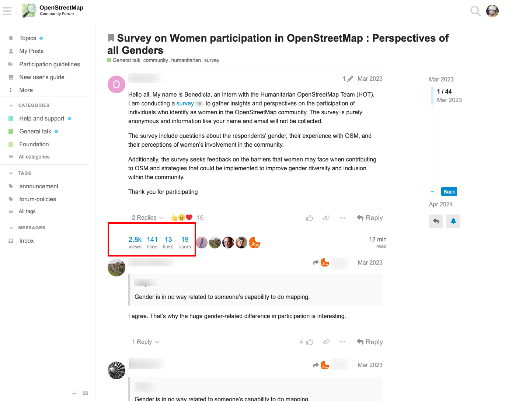
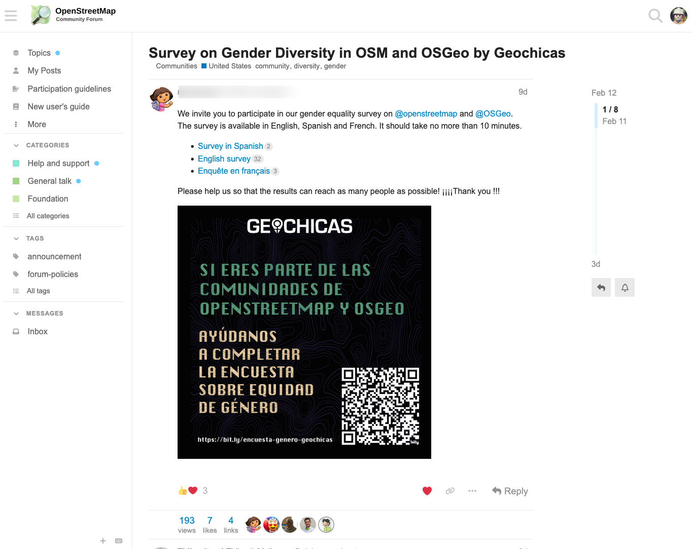
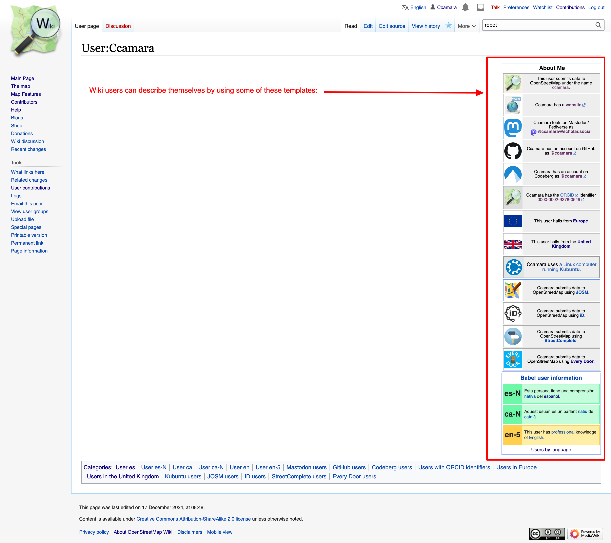

```{r setup}
#| output: false
#| warning: false


update_data <- FALSE

# Dependencies --------------------

library(dplyr)
library(forcats)
library(ggplot2)
library(httr)
library(jsonlite)
library(rvest)
library(stringr)
library(tidycountries)
library(tidyr)


# Get a list of all .R files in the folder
r_files <- list.files(path = "R", pattern = "\\.R$", full.names = TRUE)

# Source each .R file
lapply(r_files, source)


```

```{r ggplot_theming}

theme_set(theme_minimal())
theme_update(plot.title = element_text(face="bold"),
             # plot.subtitle = ggtext::element_markdown(),
             legend.position = "top",
             legend.direction = "horizontal",
             legend.box = "horizontal")

```

```{r stats}

osm_stats <- get_osm_stats()

osm_users <- osm_stats$value[1]

if (update_data == TRUE) {
  osm_users_wiki_df <- get_users_wiki("data/raw/osm_wiki_users.csv")
}

osm_users_wiki_df <- read.csv("data/raw/osm_wiki_users.csv")

osm_users_wiki <- nrow(osm_users_wiki_df)


```

```{r countries}
library(httr)
library(jsonlite)

# Define the SPARQL query to retrieve all countries and their population
query <- "
SELECT ?countryLabel ?population WHERE {
  ?country wdt:P31 wd:Q6256;  # instance of country
           wdt:P1082 ?population.  # population property
  SERVICE wikibase:label { bd:serviceParam wikibase:language \"[AUTO_LANGUAGE],en\". }
}
ORDER BY ?countryLabel
"

# Define the API endpoint
url <- "https://query.wikidata.org/sparql"

# Make the GET request
response <- GET(url, query = list(query = query, format = "json"))

# Check if the request was successful
if (status_code(response) == 200) {
    # Parse the JSON response
    content <- fromJSON(content(response, "text", encoding = "UTF-8"))
    results <- content$results$bindings
    
    # Extract country names and population
    countries <- data.frame(
      country <- results$countryLabel$value,
      population <- results$population$value
    ) |> 
      rename(country = 1, population = 2) |> 
      mutate(population = as.numeric(population))
} else {
    print(paste("Error:", status_code(response)))
}

countries_osm <- countries |> 
  filter(population < osm_users)
```

```{r tidycountries}
country_info <- tidycountries::restcountries_tidy_data
```

## Previously {.smaller}

We tried to map actors and projects in OSM. During the meeting we were pointed to interesting resources faced some challenges:

- **Scope:** what kind of projects and actors do we want to include? We know they should be within OSM, but are they to be related to any underrepresented groups or just one category? (gender, ethnicity, sexual orientation...)

- **Population mechanism:** how and who can/should populate the dataset? How to ensure that information is exhaustive, up-to-date? How do we know if something is happening?

------------------------------------------------------------------------

### Potential workarounds:

1.  We could try to automate data extraction and visualisations, with caveats.

2.  We could focus on a specific group (e.g. Geochicas) are doing, and use it as a case to explain their story (who their members are, their demographics, their topics, their initiatives...)

**These slides explore #1:** Following Silvia's pointer, we have been exploring how to use wiki categories in an automated way.

## OSM users {.smaller}

There are **a total of `r format(osm_users, big.mark = ",")` OSM users**[^1]

[^1]: Source: <https://planet.openstreetmap.org/statistics/data_stats.html>

```{r}
#| echo: false

osm_as_country <- data.frame(
  common_name = "OpenStreetMap",
  population = osm_users,
  flags_svg = "https://wiki.openstreetmap.org/w/images/7/79/Public-images-osm_logo.svg"
)

countries_osm <- country_info |> 
  select(common_name, cca2, population, flags_png) |> 
  unique() |> 
  # bind_rows(osm_as_country) |> 
  arrange(desc(population)) |> 
  mutate(common_name = fct_reorder(common_name, population)) |> 
  mutate(highlight = case_when(
    population == min(population) ~ TRUE,
    population == max(population) ~ TRUE,
    common_name == "OpenStreetMap" ~ TRUE
  ))


# Calculate the indices for the first, last, middle, 25th percentile, and 75th percentile values
n <- nrow(countries_osm)

indices <- c(1, 2, 3, 4, ceiling(n * 0.25), ceiling(n / 2), ceiling(n * 0.75), n)

# Filter the dataframe to get the desired rows
filtered_df <- countries_osm |> 
  slice(indices)
  
# countries_osm |> 
#   slice(indices) |> 
#   # bind_rows(osm_as_country) |> 
#   arrange(desc(population)) |> 
#   mutate(common_name = fct_reorder(common_name, population)) |> 
#   ggplot(aes(x = population, y = 1, size = population, country = tolower(cca2))) +
#   # ggplot(countries, aes(x = reorder(common_name, population), y = population)) +
#   geom_point() +
#   ggflags::geom_flag() +
#   ggflags::scale_country() +
#   scale_size(range = c(0, 15)) +
#   ggimage::geom_image(aes(image = flags_png, size = population )) +
#   # scale_size_continuous(range = c(3, 10)) +
#   labs(x = "Country", y = "Population", title = "Countries by Population with Flags") +
#   theme(axis.text.x = element_text(angle = 90, hjust = 1)) +
#   theme_minimal()
```

There are 95 countries with less population!

```{r}


countries_osm <- countries |> 
  filter(population < osm_users) |> 
  arrange(desc(population))

countries_osm |> 
  mutate(population = format(population, big.mark = ",")) |> 
  head(5) |> 
  knitr::kable()


# TODO: Show a data visualisation with either their shapes and names, or a slider between the most populated country and the least, and a pointer with OSM.
```

------------------------------------------------------------------------

<https://wiki.openstreetmap.org/wiki/Stats> Provides lots of interesting stats about users, like:

::::: columns
::: {.column width="50%"}

:::

::: {.column width="50%"}

:::
:::::

How many of them are actively contributing

## But...

We do not know anything about their demographics.

- Where do they contribute from?

- Which languages do they speak?

- What's their ethnicity, gender, sexual orientation...?

::: callout-important
This information would inform about the world-views that are embedded on OSM community and its map.
:::

<!-- This matters because literature shows that different types of users perceive and navigate the spaces differently, because -->

## Others have requested this

::::: columns
::: {.column width="50%"}

:::

::: {.column width="50%"}

:::
:::::

## OSM Wiki as a proxy {.smaller}

::::: columns
::: {.column width="50%"}

:::

::: {.column width="50%"}
As the only information about a user is their username, **there's no census of OSM**.

Wiki users may want to add details to their personal page to disclose some features about themselves.

These features can be as diverse as:

- Software used
- Location
- Languages spoken
- ...
:::
:::::

## Users by location

```{r}
#| output: true
#| warning: false

if (update_data == TRUE) {
  usrs_country <- get_users_category("https://wiki.openstreetmap.org/wiki/Category:Users_by_country") 
  write.csv(usrs_country, "data/processed/wiki_users_country.csv", 
            row.names = FALSE)
}

usrs_country <- read.csv("data/processed/wiki_users_country.csv") |> 
  mutate(variable = str_remove(variable, "‎"),
         variable = str_remove(variable, "the "))


country_region <- country_info |> 
  select(common_name, official_name, region, subregion, population) |> 
  unique()


total_users <- sum(usrs_country$pages, na.rm = TRUE)

usrs_country |> 
  count(variable, wt = pages, sort = TRUE) |> 
  left_join(country_region, by = join_by(variable == common_name)) |> 
  mutate(variable = fct_reorder(variable, n)) |> 
  head(25) |> 
  ggplot(aes(x = n, y = variable, label = n, fill = region)) +
  geom_col() +
  geom_text(hjust = 1.5, size = 3, color = "white") +
  labs(title = "Top 25 countries based on number of users",
       subtitle = paste("Number of users reporting their location:",
                        format(total_users, big.mark = ",")),
       caption = "Source: OSM Wiki",
       x = NULL,
       y = NULL) +
  theme(panel.grid.major.y = element_blank())
```

------------------------------------------------------------------------

Relative

```{r}
library(treemapify)

usrs_country |> 
  count(variable, wt = pages, sort = TRUE) |> 
  left_join(country_region, by = join_by(variable == common_name)) |> 
  filter(!is.na(region)) |> 
  # mutate(region = replace_na(region, "Other")) |> 
  # mutate(variable = as.character(variable)) |> 
  # arrange(desc(region), desc(n)) |> 
  # mutate(variable = fct_reorder(variable, n)) |> 
  ggplot(aes(area = n, fill = region, label = variable, subgroup = region)) +
  geom_treemap(color = "white") +
  geom_treemap_subgroup_border(color = "white")+
  geom_treemap_text() + 
  scale_fill_brewer(palette = "Paired") + 
  labs(title = "Proportion of users by country",
       fill = NULL,
       caption = "Only showing users who have reported their location. Source: wiki.openstreetmap.org") +
  guides(fill = guide_legend(nrow = 1))
```

## Users by language

```{r}

if (update_data == TRUE) {
  usrs_language <- get_users_language(details = TRUE)
  write.csv(usrs_language, "data/processed/wiki_users_language_details.csv", 
            row.names = FALSE)
}

usrs_language <- read.csv("data/processed/wiki_users_language_details.csv") |> 
  count(language, level, wt = pages, name = "pages") |> 
  filter(level != 0) |> 
  mutate(id = row_number()) |> 
  # mutate(pages = replace_na(pages, 0)) |> 
  tidyr::pivot_wider(id_cols = language, names_from = level, values_from = pages,
                     names_expand = TRUE,
                     # names_prefix = "Level",
                     values_fill = 0) |> 
  mutate(total = rowSums(across(where(is.numeric)))) |> 
  pivot_longer(!c(language, total), names_to = "level", values_to = "pages") |> 
  mutate(level = fct_relevel(level, "1", "2", "3", "4", "5", "N"))

languages_codes <- read.csv("data/raw/languages_codes.csv")

usrs_language <- usrs_language |> 
  left_join(languages_codes, by = join_by(language == code_2))


usrs_language |> 
  arrange(desc(total)) |> 
  mutate(language = fct_reorder(language, total),
         name = fct_reorder(name, total)) |> 
  head(120) |> 
  ggplot(aes(x = pages, y = name, fill = level)) +
  geom_bar(position="stack", stat="identity") +
  # geom_col(aes(fill = level)) +
  geom_text(aes(x = total, label = total, fill = NULL), hjust = -0.5, size = 3) +
  labs(title = "Top 20 languages based on number of users",
       caption = "Source: OSM Wiki",
       x = NULL,
       y = NULL) +
  scale_fill_brewer(type = "seq", palette = "YlGn") +
  theme(panel.grid.major.y = element_blank()) +
  guides(fill = guide_legend(nrow = 1))

```

------------------------------------------------------------------------

```{r}
usrs_language |> 
  arrange(desc(total)) |> 
  filter(!is.na(name)) |> 
  ggplot(aes(area = pages, fill = level, label = level, subgroup = name)) +
  geom_treemap() +
  geom_treemap_subgroup_border(color = "white") +
  geom_treemap_subgroup_text(place = "bottomleft", grow = TRUE)+ 
  scale_fill_brewer(type = "seq", palette = "Greens") +
  # geom_treemap_text() + 
  labs(title = "Proportion of users by language",
       fill = NULL) + 
  guides(fill = guide_legend(nrow = 1))
```

## Users by gender

```{r}

# Manually generate dataset from https://wiki.openstreetmap.org/wiki/Category:Gender
usrs_gender <- data.frame(
  gender <- as.factor(c("male", "female")),
  n <- c(12, 11)
)

usrs_gender |> 
ggplot(aes(x = n, y = gender)) +
  geom_bar(position="stack", stat="identity") +
  # geom_col(aes(fill = level)) +
  geom_text(aes(x = n, label = n, fill = NULL), hjust = -0.5, size = 3) +
  labs(title = "Users by gender",
       caption = "Source: OSM Wiki",
       x = NULL,
       y = NULL) +
  theme(panel.grid.major.y = element_blank()) +
  guides(fill = guide_legend(nrow = 1))

```

::: callout-warning
Only 23 users have this information!
:::

## (preliminary) Results {.smaller}

OSM community[^2] has over-representation of hegemonic demographics:

[^2]: A subset of wiki users

- More than 2/3 of users are from Europe, with a prominence of users from Germany and France.

- More than half of the users speak English or German. The rest of the 50% is divided across multiple languages.

  - This is unsurprisingly, given that the vast majority of wiki pages (TODO: count them) are written in English. English is also the language used in tagging and the OSMF.

- Little interest in acknowledging diversity:

  - Few people (23) disclosed their gender

  - Nobody has disclosed ethnicity or sexual orientation using categories

## But... {.smaller}

::: callout-warning
### Results are not statistically relevant/representative:

- According to the wiki, there are **a total of `r format(osm_users_wiki, big.mark = ",")` wiki users**, this represents a tiny `r scales::label_percent()(osm_users_wiki/osm_users)` of total OSM users ( **`r format(osm_users, big.mark = ",")` OSM users**).
- Not all wiki users have added that information to their profiles
  - Out of the wiki users, only a fraction have disclosed that information (eg. only 6,003 have information about their countries a 3.8% out of the 2%)
:::

#### Exploring alternative approach:

- Complement it with surveys?
- Do not look at what users says about themselves, but **focus on what users do.**
  - **This is what we will be exploring in our next codesign session!**

## Sources of info

- This wiki page provides stats about number of wiki users and relevant info: <https://wiki.openstreetmap.org/wiki/Special:Statistics>

- This page contains all users by language: <https://wiki.openstreetmap.org/wiki/Category:Users_by_language>

- <https://wiki.openstreetmap.org/wiki/Category:Users_by_country>

- <https://wiki.openstreetmap.org/wiki/Category:Europe>
